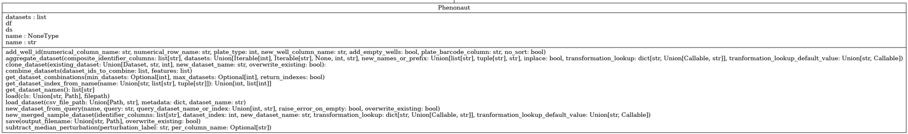
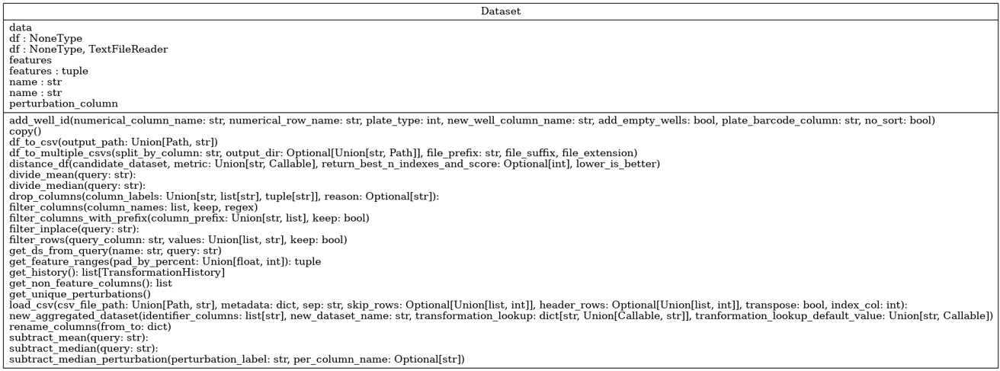
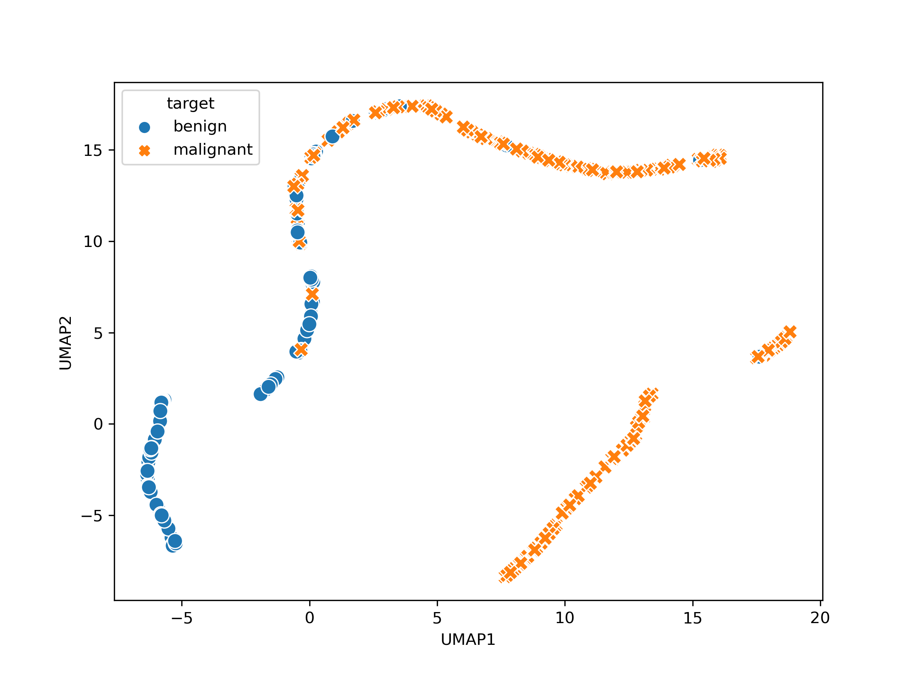

.. _User guide:

User guide
##########

For a full listing of capabilities, classes and functions available within Phenonaut, please refer to the online API documentation which is constantly expanding as new literature techniques are integrated.

=========
Phenonaut
=========

---------------
Phenonaut class
---------------

A typical Phenonaut run begins with instantiation of a Phenonaut object.
Many options for instantiation are permitted, with an empty object created if no parameters are given. 

.. code-block:: python
        
    from phenonaut import Phenonaut
    phe=Phenonaut()

Please refer to Phenonaut API documentation for a complete description of Phenonaut constructor arguments and member functions.
An instantiated Phenonaut object has the following member variables:

* datasets - a list of Dataset objects. 
* df - shorthand notation to access the Pandas DataFrame of the last Dataset in the datasets list.
* ds - shorthand notation to access the last Dataset in the datasets list.
* name - string containing a name for the Phenonaut object, this simplifies working with multiple Phenonaut objects in list-like structures.

    Full typing hinting is too long to display here, but available in :doc:`phenonaut` documentation 

In addition to these member variables, we can access the datasets list using dictionary-like accessors. For example, with an instantiated Phenonaut object stored in the variable “phe” containing two datasets “Alice” and “Bob”, we may access them using dictionary-like and list-like accessors.
    
    .. code-block:: python
        
        phe["Alice"] # Access the Alice Dataset
        phe["Bob"] # Access the Bob Dataset
        phe[0]  # Access the first (Alice) Dataset
        phe[1]  # Access the second (Bob) Dataset
        phe[-1] # Access the last (Bob) Dataset

Phenonaut objects along with all data they hold may be easily written to python pickle files:
    
    .. code-block:: python
        
        phe.save("phe.pkl")

Pickled Phenonaut objects may be loaded in the following way:
    
    .. code-block:: python
    
        phe=Phenonaut.load("phe.pkl")

--------------
Datasets class
--------------

Datasets in Phenonaut encapsulate Pandas DataFrames and provide functionality to monitor features within the DataFrame, along with metadata, and provide a consistent interface for Phenonaut's transforms, predictions and metrics.
 

A user supplied CSV file may be used to instantiate a Dataset object. Using a CSV file containing the following small sample of the Iris dataset:

================= ================ ================= ================ ======
sepal length (cm) sepal width (cm) petal length (cm) petal width (cm) target
================= ================ ================= ================ ======
5.4                3.4               1.7              0.2              0
7.2                3.0               5.8               1.6             2
6.4                2.8               5.6               2.1             2
4.8                3.1               1.60               2              0
5.6                2.5               3.9               1.1             1
================= ================ ================= ================ ======

It may be loaded into a Dataset object using three different feature selection methods:

#.	The 'features' key, specifying a list of features. 
#.	The 'features_prefix' key, specifying a common prefix.
#.	The 'features_regex' key, specifying a regular expression

All three feature selection methods/keys may be used in combination with the others, with the final list of selected features across methods being uniquified and sorted.

Alternatively, we may use a feature_prefix field to flag all features which share a common prefix. This can be used in combination with a features list, both are merged at the end.

Whilst not recommended, it is possible to create a dataset without any features by explicitly specifying features to be an empty list.

**Feature selection using the 'features' metadata key**

.. code-block:: python

    from phenonaut.data import Dataset
    ds = Dataset(
        "small iris",
        "projects/iris/small_iris.csv",
        {"features": ["sepal length (cm)", "sepal width (cm)", "petal length (cm)", "petal width (cm)"]},
    )

**Feature selection using the features_prefix metadata key**

Note that multiple prefixes can be given in a list as shown below, specifying 'sepal' and' petal'

.. code-block:: python

    from phenonaut.data import Dataset
    ds = Dataset(
        "small iris",
        "projects/iris/small_iris.csv",
        {"features_prefix": ["sepal", "petal"]},
    )

**Feature selection using the 'featrures_regex' metadata key**

Here, we match the words 'width' or 'length' surrounded by any number of other characters.

.. code-block:: python

    from phenonaut.data import Dataset
    ds = Dataset(
        "small iris",
        "projects/iris/small_iris.csv",
        {"features_regex":".*(width|length).*"},
    )

Please refer to Phenonaut API documentation for a complete description of Dataset arguments.

Accessing the underlying DataFrame is achieved as follows:

.. code-block:: python

    ds.df

A DataFrame of only features may also be accessed via the *data* property, useful as input to transforms etc.
    
.. code-block:: python

    ds.data # equivalent to calling ds.df[ds.features]

If we wish to change the features, for example, by removing “sepal length (cm)”, we may supply the updated list of features, along with a description of the change in text format which is logged:

.. code-block:: python

    new_features=[f for f in ds.features if f != "sepal length (cm)"]
    explanation_string="Removed sepal length (cm) feature"
    ds.features=(new_features, explanation_string)

Note we set features to a tuple with the first element being a list containing the new features, and the second element being an explanation string.
The history of a dataset can be examined through accessing the 'history' property of the dataset, or calling .get_history() with both returning a list of named tuples representing the changes a dataset went through. For all history tuples, the first element is a list of features (also accessible through calling .features on the NamedTuple), and the second element is a history message (accessible through calling .description on the NamedTuple).

.. code-block:: python

    ds.history

or

.. code-block:: python

    ds.get_history()

Resulting the return of a list of history tuples.

.. code-block:: console
    
    [TransformationHistory(features=['petal length (cm)', 'petal width (cm)', 'sepal length (cm)', 'sepal width (cm)'], description='Loaded /tmp/tmpcu2rpsai, sep=\',\'", skiprows=None, header=[0], transpose=False, index_col=None, metadata={\'features_regex\': \'.*(width|length).*\', \'initial_features\': [\'petal length (cm)\', \'petal width (cm)\', \'sepal length (cm)\', \'sepal width (cm)\']}, init_hash=None, '), TransformationHistory(features=['petal length (cm)', 'petal width (cm)', 'sepal width (cm)'], description='Removed sepal length (cm) feature')]

Datasets can be passed to the constructors of Phenonaut objects to instantiate them with the dataset.

.. code-block:: python

    from phenonaut import Phenonaut
    from phenonaut.data import Dataset
    ds = Dataset(
        "small iris",
        "projects/iris/small_iris.csv",
        {"features": ["sepal length (cm)", "sepal width (cm)", "petal length (cm)", "petal width (cm)"]},
    )
    phe=Phenonaut(ds)

Alternatively, we can add a dataset to an already instantiated Phenonaut object using dictionary-like keys:

.. code-block:: python

    phe["new small iris"]=ds

Rather than creating a Dataset object to pass to Phenonaut, we may call the load_dataset function of an instantiated Phenonaut object to load a CSV file into a dataset.

.. code-block:: python

    from phenonaut import Phenonaut
    phe=Phenonaut()
    phe.load_dataset("small iris", "projects/iris/small_iris.csv",
        {"features": ["sepal length (cm)", "sepal width (cm)", "petal length (cm)", "petal width (cm)"]}
    )

---------------------------------------
Datasets containing one feature per-row
---------------------------------------

By default, Phenonaut expects features to be present in columns, with one
column capturing a feature, and one row representing a sample, like:

================= ================ ================= ================ ======
sepal length (cm) sepal width (cm) petal length (cm) petal width (cm) target
================= ================ ================= ================ ======
5.4                3.4               1.7              0.2              0
7.2                3.0               5.8               1.6             2
6.4                2.8               5.6               2.1             2
4.8                3.1               1.60               2              0
5.6                2.5               3.9               1.1             1
================= ================ ================= ================ ======

In the above dataset, we may indicate to Phenonaut that the features are:

* sepal length (cm)
* sepal width (cm)
* petal length (cm)
* petal width (cm)

All other columns (in this case, 'target') are deemed metadata columns.

Phenonaut is data structure agnostic, instead of having dataloaders for specific
formats, Phenonaut relies upon transformations at the read-in stage to manipulate
different formats into the above column features-format.

Below, we see an example (fake data, often encountered structure) dataset from
DRUG-seq, with just 2 ensemble IDs being measured across 4 wells (A1, A2, A3, and A4).
It is vastly different to the internal format required by Phenonaut.

.. csv-table:: DRUG-seq sample output, 2 measurements per well, for 4 wells.
    :header: "","Var1","Var2","value"
    
    "1","ENSG00000225972","A1_CPD1_PLATE1",4.0185
    "2","ENSG00000225630","A1_CPD1_PLATE1",1.1539
    "3","ENSG00000225972","A2_CPD2_PLATE1",10.6661
    "4","ENSG00000225630","A2_CPD2_PLATE1",1.6130
    "5","ENSG00000225972","A3_CPD3_PLATE1",0.1234
    "6","ENSG00000225630","A3_CPD3_PLATE1",9.8436
    "7","ENSG00000225972","A4_Pos_ctrl_PLATE1",0.1234
    "8","ENSG00000225630","A4_Pos_ctrl_PLATE1",9.8436
    
Fortunately, Phenonaut offers the ability to perform transforms on the data upon reading it in.
This is achieved through use of the 'transforms' key in metadata.  The 'transforms' key should
have under it a list of transforms to be applied to the data.  These transforms can be any member
function of the Phenonaut Dataset class, and has the form:

.. code-block:: python

    ('replace_str',('target_column', 'Pos_','Pos-')),
    ('replace_str','target_column', 'Pos_','Pos-'),

The above shows 2 ways to invoke the phenonaut.data.Dataset.replace_str function,
with list elements consisting of tuples in two forms:

* 2 elements in the tuple, 1st element being the name of the function to be called, and the second element as a tuple of arguments to be passed to that function.
* n-elements in the tuple, whereby the 1st element is the name of the function to be called, and subsequent elements are arguments to be passed to the function.

We have features listed one per-row and occurring once for every well on a plate
measured. 

Our target format for this dataset would be:

.. csv-table:: Ideal, transformed DRUG-seq sample output, 2 counts measurements per well, for 3 wells.
    :header: "WellName","CpdID","PlateID","ENSG00000225972", "ENSG00000225630"
    
    "A1", "CPD1", "PLATE1", 4.0185, 1.1539
    "A2", "CPD2", "PLATE1", 10.6661, 1.6130
    "A3", "CPD3", "PLATE1", 0.1234, 9.8436
    "A4", "Pos_ctrl", "PLATE1", 0.1234, 9.8436

To achieve this we need to carry out transforms when reading in the csv file.
We need to address the following with transforms:

* The 'Var2' column contains underscores which we may split on to generate new columns containing the WellName, CpdID and PlateIDs.
  however, the last two lines of the file contains a different number of underscores in the Var2 column than all other wells.
  This is due to the presence of: 'A4_Pos_ctrl_PLATE1'. We must therefore replace the 'Pos\_' text with a character that we will not
  split on.

  .. code-block:: python
    
    ("replace_str", "Var2", "Pos_", "Pos-")
* Split the Var2 column on the underscore character to create 3 new columns:
  
  .. code-block:: python
    
    ("split_column", "Var2", "_", ['WellID','CpdID','PlateID'])

* Pivot the table, populating new features with the values in the 'Var1' column, and their
  values from the 'value' column. Further reading on pivoting can help in grasping
  the idea behind this transformation.  See : `https://pandas.pydata.org/docs/user_guide/reshaping.html <https://pandas.pydata.org/docs/user_guide/reshaping.html>`_
  
  .. code-block:: python
    
    ("pivot", "Var1", 'value')

* We may optionally undo the renaming operation now that we have split the filed, and replace 'Pos-' with 'Pos\_' in the 'CpdID' column:
  
  .. code-block:: python
    
    ("replace_str", "CpdID", "Pos-", "Pos_")

Putting it all together produces the following phenonaut code, containing metadata, with nested transform keys:

.. code-block:: python
    
    phe = Phenonaut(
        "DRUG-seq_input_file.csv",
        metadata={
            "transforms": [
                ("replace_str", "Var2", "Pos_", "Pos"),
                ("split_column", "Var2", "_", ['WellID','CpdID','PlateID']),
                ("pivot", "Var1", 'value'),
                ("replace_str", "CpdID", "Pos-", "Pos_"),
            ],
            'features_prefix':'ENSG'
        },
    )
    

-----------------
Packaged datasets
-----------------

Phenonaut contains a selection of public datasets, which can be accessed using classes inheriting from the PackagedDataset class. Users and developers are encouraged to write their own packaged dataset loaders using the Phenonaut framework and either submit pull requests for inclusion into Phenonaut or contact the authors.
The initial v1.0.0 release of Phenonaut contains the following packaged datasets:

* The Cancer Genome Atlas (Weinstein 2013) prepared using methods described by Lee (Lee 2021).  Named “TCGA”.
* Connectivity Map (Lamb 2006). Named “CMAP”.
* The Iris dataset (Yann). Named “Iris”.
* The Breast cancer Wisconsin (diagnostic) dataset (Wisconsin). Named “BreastCancer”.

References:
    * Weinstein, John N., et al. "The cancer genome atlas pan-cancer analysis project." Nature genetics 45.10 (2013): 1113-1120.
    * Lee, Changhee, and Mihaela van der Schaar. "A variational information bottleneck approach to multi-omics data integration." International Conference on Artificial Intelligence and Statistics. PMLR, 2021.
    * Lamb, Justin, et al. "The Connectivity Map: using gene-expression signatures to connect small molecules, genes, and disease." science 313.5795 (2006): 1929-1935.
    * Yann, http://yann.lecun.com/exdb/mnist/, (visited 27/4/2022)
    * Wisconsin, https://archive.ics.uci.edu/ml/datasets/Breast+Cancer+Wisconsin+(Diagnostic), (visited 27/4/2022) *

Please see :doc:`phenonaut.packaged_datasets` API documentation for a full definition and argument usage of PackagedDataset derived classes.

Packaged datasets can be loaded as follows:

.. code-block:: python

    from phenonaut.packaged_datasets import BreastCancer
    bc_packaged_dataset=BreastCancer("/tmp/")

Note the supply of a path (“/tmp/”) to the constructor of the PackagedDataset derived class. PackagedDatasets do not rely on the existence of the packaged dataset being available on the filesystem and will retrieve the dataset before writing it to the given data directory or in the case of the example above, linux's temporary directory /tmp.
As packaged datasets may contain multiple views, a dictionary like notation can be used to access the views. Calling .keys() returns available Dataset names, and iterating on the PackagedDataset derived class returns keys, like a dictionary.

If a PackagedDataset derived class is passed to a Phenonaut object constructor, then a Phenonaut object is constructed containing all Datasets within the PackagedDataset derived class.

.. code-block:: python

    from phenonaut import Phenonaut
    from phenonaut.packaged_datasets import BreastCancer
    phe=Phenonaut(BreastCancer("/tmp/"))
    print(phe.keys())

Outputs:

.. code-block:: python

    ['Breast_Cancer']

We may then perform a visualisation on the data, by performing the following steps:

#. Remove highly correlated features using the variance inflation factor (VIF) technique built into Phenonaut.
#. Perform UMAP dimensionality reduction.
#. Produce scatter plot.

Removing highly correlated features
,,,,,,,,,,,,,,,,,,,,,,,,,,,,,,,,,,,

.. code-block:: python

    from phenonaut.transforms.preparative import VIF
    VIF().filter(phe[0])
    
With no arguments passed to filter apart from the Dataset to be filtered, a VIF cutoff of 5 is used. This reduces the number of features to from 31 to 13:
    
.. code-block:: python
    
    print(phe[0].features)

Outputs:

.. code-block:: python

    ['worst area', 'mean texture', 'mean symmetry', 'texture error', 'symmetry error', 'worst symmetry', 'concavity error', 'mean smoothness', 'perimeter error', 'smoothness error', 'concave points error', 'mean fractal dimension', 'fractal dimension error']

Applying UMAP
,,,,,,,,,,,,,

We then apply the UMAP dimensionality reduction technique to the Dataset, using no arguments apart from the Dataset to be operated on – producing a 2D UMAP embedding:

.. code-block:: python
    
    from phenonaut.transforms import UMAP
    UMAP()(phe[0])

Plotting the results
,,,,,,,,,,,,,,,,,,,,

Finally, we plot the output. To achieve this, we exploit a special property of datasets which may have a perturbation_column value set. This refers to a non-feature column which can be used to distinguish between samples for plotting and grouping purposes. First, however, we change the values in the target column from 0 and 1 to benign and malignant respectively, this enables proper labelling to be automatically applied to plots.

.. code-block:: python

    from phenonaut.output import Scatter
    phe[0].df["target"]= phe[0].df["target"].map({0:"benign", 1:"malignant"})
    phe[0].perturbation_column="target"
    scatter=Scatter(title="UMAP of breast cancer dataset, VIF filtered")
    scatter.add(phe[0])

Which produces the following plot showing separation between benign and malignant tumor samples.

    
    Output from the scatter visualisation applied to the breast cancer dataset after VIF filtering and applying UMAP dimensionality reduction to two dimensions, showing an apparent separation within feature space of benign vs malignant tumours.

